# “GrabCut” — Interactive Foreground Extraction using Iterated Graph Cuts

> Author: Yuchao Gu

> E-mail: 2015014178@buct.edu.cn

> Date: 2018-06-06

> Description: my implementation of paper 《“GrabCut” — Interactive Foreground Extraction using Iterated Graph Cuts》

***

## Introduction

### 实现目标

interactive  foreground/background  segmentation
用户仅需要简单划定前后景区域就能实现前后景分离

***
Example:

<center>
   
   
</center>

***

### 要解决的问题
#### Question1: 如何分割

假如前景与背景的边权值较小，我们可以用mincut-maxflow算法解决
<center>
	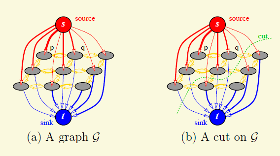
</center>

***

#### Question2: 如何表示边的权值

基于能量的表示方法：Gibbi Energy
（假定已经存在一个model θ 可以分别计算pixel属于background和foreground的概率）

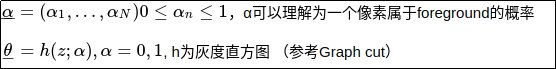

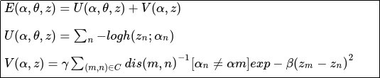

***

#### Question3: 如何立前景与背景的模型

<font color=black size=5 face="黑体">用Gaussian Distribution去拟合像素分布:</font>

<center>
	
</center>


假定有两个Gaussian Single Model，一个是拟合foreground，一个是拟合background，一个任意的pixel可以求其在两个Gaussian中的概率值

***

<font color=black size=5 face="黑体">Gaussian Single Model的不足:</font>

* GSM表达力不足

我们引入:Gaussian Mixture Model（GMM）
<center>
   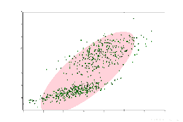 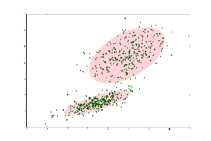
</center>

***
<font color=black size=5 face="黑体">引入GMM后，能量函数变为:</font>

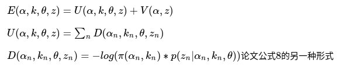

其中: p为 Multivariate Gussian Distribution:

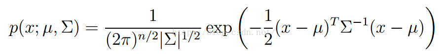

代入得:

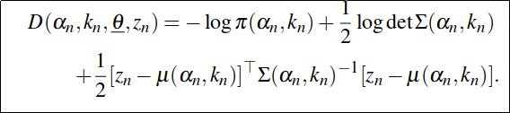

***

<font color=black size=5 face="黑体">如何计算GMM参数:</font>

EM算法：
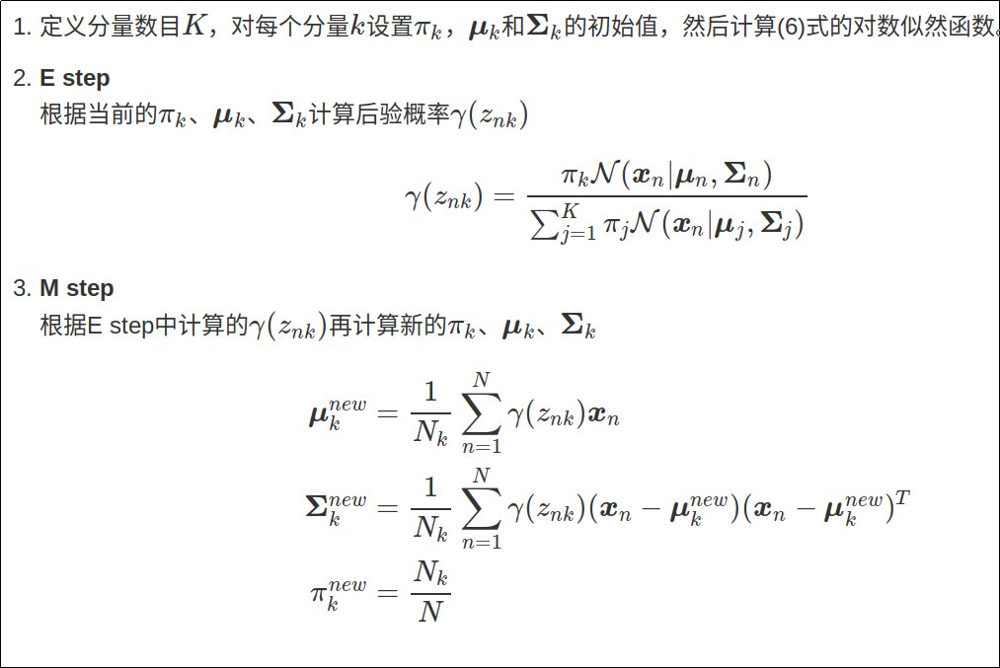

***

#### Question4: Grabcut

pixel有四种标定形式:

* Ground Truth Background 用户框外的像素(迭代中不会更改)
* Ground Truth Foreground 用户额外指定的像素(迭代中不会更改)
* Probable Background 迭代中根据两个GMM的概率动态更新
* Probable Foreground 原为用户框内的元素（迭代中根据两个GMM的概率动态更新）

***

算法流程：
<center>
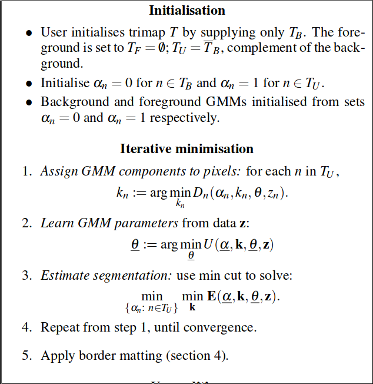
</center>


***
## Experiment

### 效果展示

***

<center>
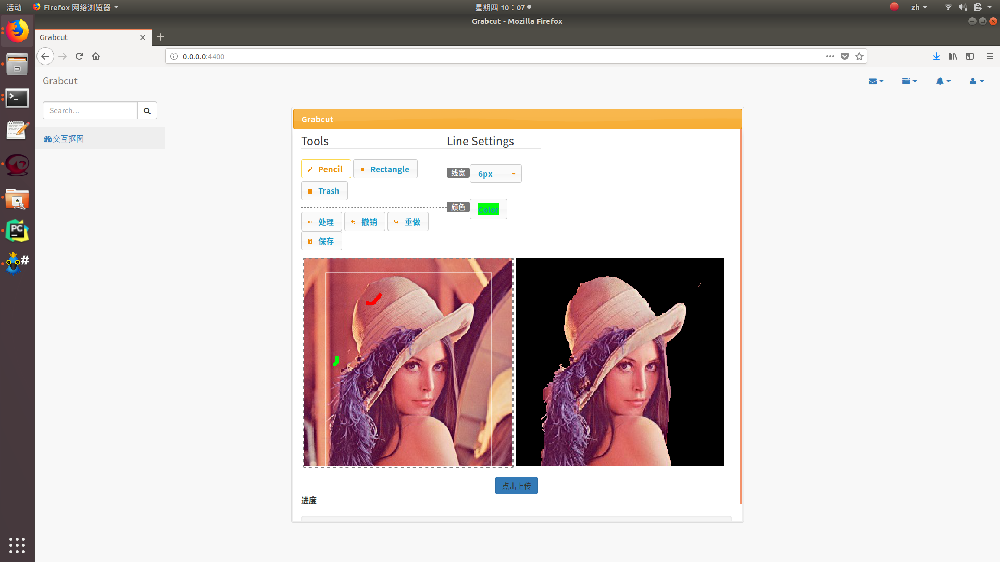
<center>

***

<center>
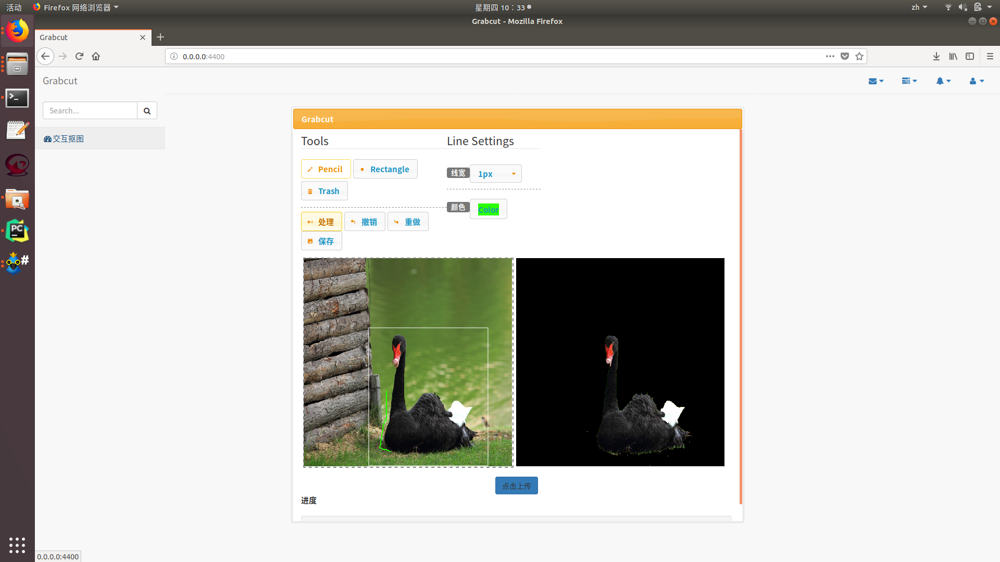
<center>

***

### 局限与不足

* python 手工实现（python for循环慢），将图片缩放成400px * 400px，速度偏慢，需等待1min左右的处理时间
* 没有实现border matting

***
### 代码结构

```
Grabcut
│
├── files  # 上传图片后的缓存
│
├── testfiles  # 测试用途
│
├── grabcut # grabcut代码
│   ├── gcgraph.py  # max-flow算法
│   ├── GMM.py # Gaussian Mixture Model
│   ├── Grabcut.py # grabcut
│   └── k-means.py # k-means算法
│
├── gycImgProcess # 图片格式base64转换
│
├── templates # 存放网页展示所需的html
│   └── grabcut.html
│
├── static # 存放jquery，bootstrap等js，css库文件
│   ├── js/myjs  # 实现的简单画图js
│   └── other files # 其余js库文件
│
├── main.py # 后端代码
│
├── readmeDisplay # 此说明文件用图
│
└── readme.md # 此说明文件
```

***
### 环境

* 依赖：`flask` `jquery`
* 系统支持：`ubuntu`
* 编程环境:`pycharm` `python3.6`

***
### 如何使用

* python main.py
* 将本地端口号输入浏览器地址栏
* 支持的操作:
	1、 矩形框选可能的前景，矩形框外的一定是背景
	2、 铅笔红色标记确认的前景
	3、 铅笔绿色标记确认的背景
* 点击process，等待结果

***
### 参考资料

* [GrabCut — Interactive Foreground Extraction using Iterated Gr
aph Cuts](https://cvg.ethz.ch/teaching/cvl/2012/grabcut-siggraph04.pdf)
* [EM及高斯混合模型](https://www.cnblogs.com/zhangchaoyang/articles/2624882.html)
* [CV | Max Flow / Min Cut 最大流最小割算法学习](https://blog.csdn.net/jzwong/article/details/70788966)

***